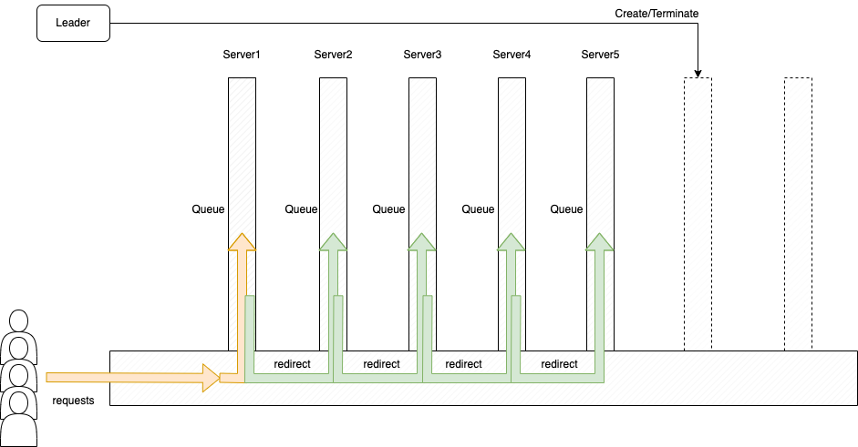

# Route Blocking

## Architecture



## Usage

There are 2 ways to run the program

1. you can run the bash script for server and client, in this way, you can see how the request is forwarding, and see the path for each request.  

- run the command below, each line with different terminal, it will start 5 servers  

```console
sh runServer.sh conf/server1.conf
sh runServer.sh conf/server2.conf 
sh runServer.sh conf/server3.conf 
sh runServer.sh conf/server4.conf 
sh runServer.sh conf/server5.conf 
```

- run the command below, the command will create multiple clients and send requests at a same time.  

```console
sh runClient.sh
```

- the result will be like this.  
Server Result  

Client Result


1. The second way is to create the server dynamically. First you need to install python3.8 and libraries.  

```console
pip install psutil
```

Then run the server first.

```console
python3 leader.py add
```

Then run the client and type in the request you want to sent.

```console
python3 run_client.py 10
```

The result will be shown like below


## Grand Challenge Introduction

We have switched from the basic socket example to the next level of
complexity with the introduction of two new technologies 1) protobuf,
and 2) gRPC. This simple addition has added capabilities to enhance
message encoding/decoding as well as several layers of abstraction over
the socket; introduces channels.

Even with the addition of protobuf and gRPC the pattern/design of our
previous example is the same. Encode message, send message, decode reply.

### Preparing

Please read/lookup information on protobuf and gRPC. While these are
separate technologies, they are coupled in the .proto file for service
specification.

#### Apple M1 (ARM) Issues

Note the protobuf (protoc) plugin for java v20 or older and the java-plugin (v1.49)
do not currently support the new apple M1 chipset.

These two are used to build the java source code files from protobuf (.proto) files.

Options:

- Native (M1)
  - Protoc: Upgrade to version 3.21.x (works on m1)
  - Java plugin: **protoc-gen-java-plugin from github does not compile**.
    - There's an issue (7690) talking about apple m1 support
    - If **you don't want to install Rosetta**
      - Generate the source files on an intel based computer and copy them to your Mac.
      - Use generated.tar.gz to get you started
- Rosetta
  - If you have installed Rosetta then you can download the x86-64 exe from
      <https://repo1.maven.org/maven2/io/grpc/protoc-gen-grpc-java/1.49.0/>

### Building

Building is more complex as we are now dependent upon a set of new
libraries (jars), and build dependencies.

- Install gRPC, protobuf, and the java-plugin onto your computer.
    Apple M1 users see notes above.
- Configure lmod files (.lua) as needed
- The project has two internal library directories (lib, lib-ref2).
- Code generation (build_pb.sh) is required

**Note: Simply importing the project into your IDE will not work.**

### Running

The execution scripts add additional functionality. Take a few
minutes to look over the scripts

### Foundation Work

After exploring the new technologies used by this lab, we begin
the work to build a strong foundation for all future class work
on distributed systems.

Work

- Be sure to understand the request-response nature of the client
    server in our lab.
- Change the client to use a configuration file like the server. Hard
    coded values in RouteClient.java are a bad design.
- Without changing the gRPC configuration (calls), extend the code
    to be nonblocking.
- Replace the printf calls to use slf4j.

Question(s)

- What are the positive and negative aspects of this code (blocking
    calls)?
- What are your timing numbers (how long does it take to send messages?)

### Core Work

Please attempt the foundation work (above) before attempting this section.

Now that you have an understanding of the technologies in use, we now get
to the core of the lab that positions us for the challenge and research.

We are starting with code you created above, it provides us:

- A basic pairwise (client-server) topology that sends 10 messages

     `(A) -----> (B)`

  - It features a nonblocking communication (you created)
  - logging

#### Code the following

Time to build from our toy problem to include more complex (many more
processes) than our first client-server work.

- Add additional servers to create a ring network (e.g., AB, BC, CA)
  
    `(A) -----> (B) -----> (C) -----> (A)`
  
- Once you have your ring working, extend it to more complex
    topologies (e.g., AB, AC, BD, CD, DE, CE)

    `What does the topology look like?`

- How did you modify the code for the branches (e.g., AB, AC)?
  
  - hint Time To Live (TTL)
  - hint Vector Clocks
  